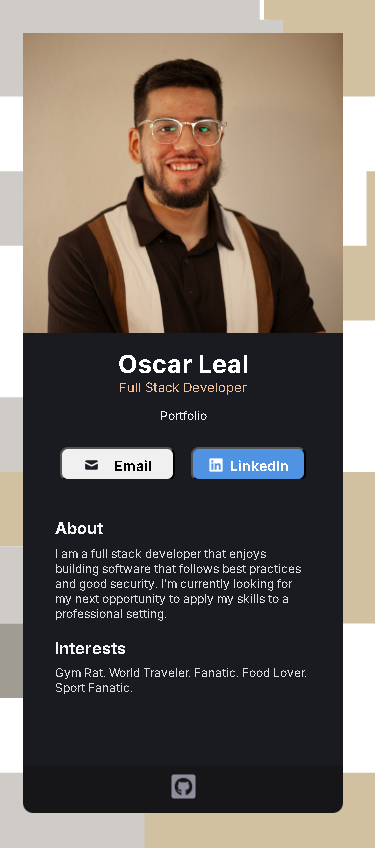

# Digital Business Card

## Description

My business card made for practice on my CSS and React skills.

## Business Case

My Digital FootPrint to use for easy access through QR Codes.

## Table of Contents

- [Features](#features)
- [Contributors](#contributors)
- [Technologies](#technologies)
- [License](#license)
- [UI](#ui)
- [LiveSite](#livesite)

## Features

When Accessed:

Can email me directly, access my LinkedIn.

Find a About section and a Interest section

Followed by my Github.

## Contributors

This application was developed by the following contributors:

- [Oscar Leal](https://github.com/Oscarl214)

## UI

## Technologies

This personal project was built using the following:

- Node.js
- React.js
- CSS

## License

    This app is licensed under the MIT license.

## LiveSite

[Business-Card.](https://oscars-business-card.netlify.app/)https://oscars-business-card.netlify.app/
